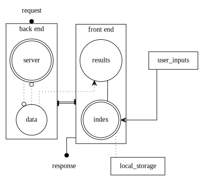

# About

-   Final Project -> Part I

## Description

-   This first version of my final project is a note taking app, which implements the knowledge gained throughout the cursus. The app does fulfill all the requirements at this point, and is enhanced with a playful use of CSS and JavaScript.

## Install & Run

1.  create a new environment
    
        python -m venv venv

2.  activate the environment
    
        . venv/bin/activate

3.  install requirements
    
        pip install -r requirements.txt

4.  run
    
        cd src/
        flask --app app run

## Usage

-   Enter a username -> you will than be randomly greeted in one of 21 different languages
-   enter a note and click the **add note** button
-   search for a specific note
-   display all of your notes, alphabetically sorted

## Issue

-   The clock doesn&rsquo;t keep its state between page loads.
    I do not know how to fix it though. Maybe using a sessionStorage ?
    Or is it all about application state and state machines ? I will figure out this issue/topic later on.

## Screenshots

<table border="2" cellspacing="0" cellpadding="6" rules="groups" frame="hsides">

<colgroup>
<col  class="org-left" />
</colgroup>
<thead>
<tr>
<th scope="col" class="org-left">Example Screenshot</th>
</tr>
</thead>

<tbody>
<tr>
<td class="org-left"></td>
</tr>
</tbody>
</table>

## Overview

